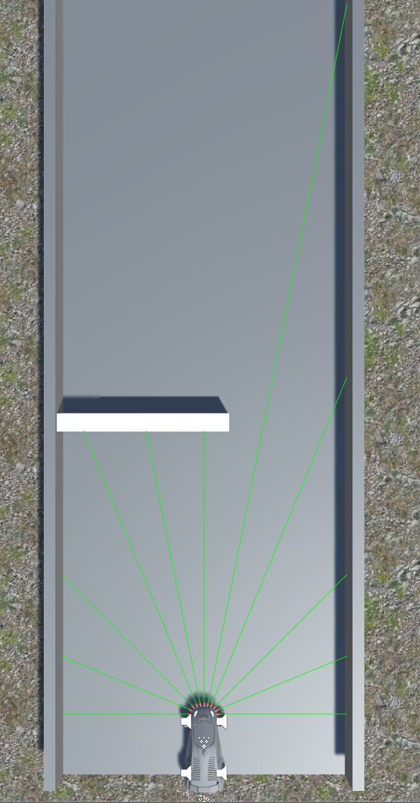
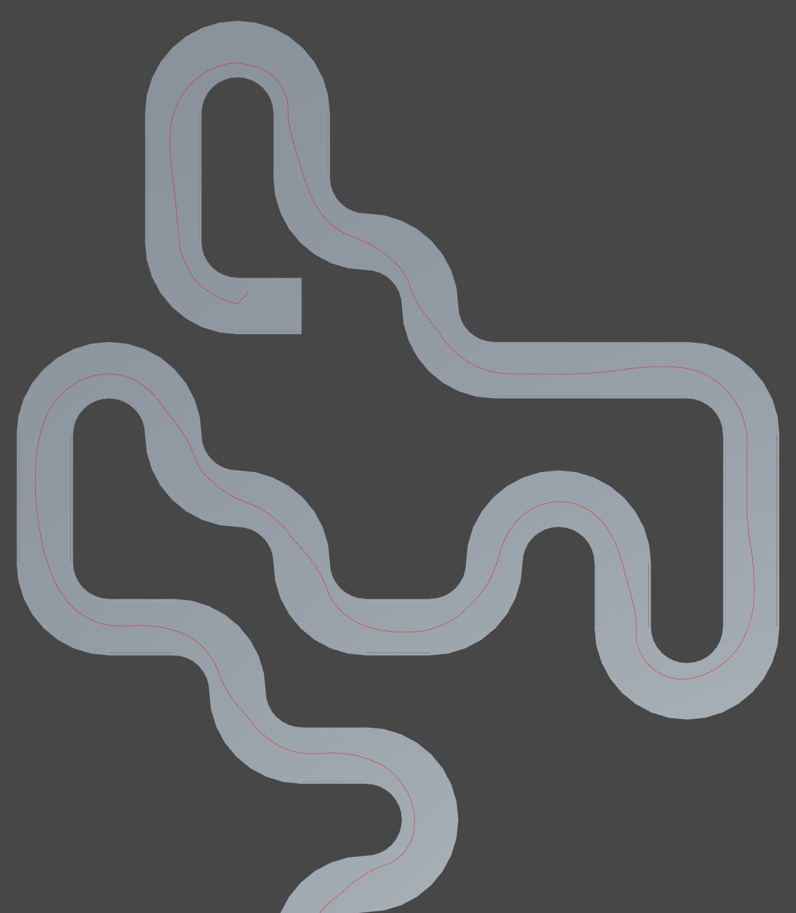

# SensorCar

Software for a self-driving car, based on artificial neural networks (ANNs). An Unity simulation is provided to run the car.



Multiple sensors (3 at the moment in the Master branch) provide distance information to the ANN. In the evaluation process, these data is used to get the steering angle.



A module is provided for generating an infinitely long, randomly road. The SensorCar is capable of driving through this road map without any collisions.

:exclamation: This project is a proof of principle and thus no high-level libraries were used for creating the ANN.

## Getting Started

These instructions will get you a copy of the project up and running on your local machine.

### Prerequisites

This project requires Unity3D and Python 3.x.

### Installing

Download a copy of this project.

Install the required Python packages with `pip`:

```
pip install -r requirements.txt
```

## Generate a Training Dataset

Load the scene `infinityRoad` from `./simulation/sensorCar/Assets/Scenes/` with Unity.

Select the Car in the `Hierarchy`.

Change the file path to the folder where the dataset will be saved in `File Path`, if necessary, in the `Inspector`.

Change the file name of the dataset in `File Name` , if necessary.

Set the delta time between two recordings in `Record Time Interval`.

Start the Project by pressing on the play button at the top of the window or in Edit -> Play .

The car can be manoeuvred with the <kbd>←</kbd> , <kbd>↑</kbd> , <kbd>→</kbd> , <kbd>↓</kbd> keys. Use the key <kbd>Space</kbd> for the handbrake.

Press <kbd>r</kbd> to start the recording and then <kbd>f</kbd> to stop it again. A checked checkbox `Is Recording in the Car Recorder indicates that a recording is in progress.

Datasets are saved to the path specified in `Record Time Interval` within the directory `./simulation/`.

## How to Train The Neural Network

Use a text editor to open `./main.py`.

Make sure that from `if __name__ == '__main__':` within `trainNetwork([5], 0.03, './simulation/dataset/trackMaster.txt', 300)`

Alter the parameters of `trainNetwork()` to suite your needs.

Run `./main.py` with the Python 3 interpreter by executing `python main.py`.

## How to Let the Car Be Controlled by the Neural Network

Use a text editor to open `./main.py`.

Make sure that from within `if __name__ == '__main__':` only `runCar('./savedNet/3-100-50-10-1-0_001-trackMaster/440.txt')` is called.

Alter the parameter of `trainNetwork()` to suite your needs.

Run `./main.py` with the Python 3 interpreter by executing `python main.py`.

Use Unity to load the scene `infinityRoad` from `./simulation/sensorCar/Assets/
Scenes/`.

Start the Project by pressing `Edit -> Play` or by pressing on the play button on
the top of the window.

Accelerate/break the car with <kbd>↑</kbd> and <kbd>↓</kbd> , respectively. The steering should be controlled by the ANN but you can intervene at any moment by pressing <kbd>←</kbd> or
<kbd>→</kbd>.

## License

This project is licensed under the MIT License - see the [LICENSE.md](LICENSE.md) file for details

